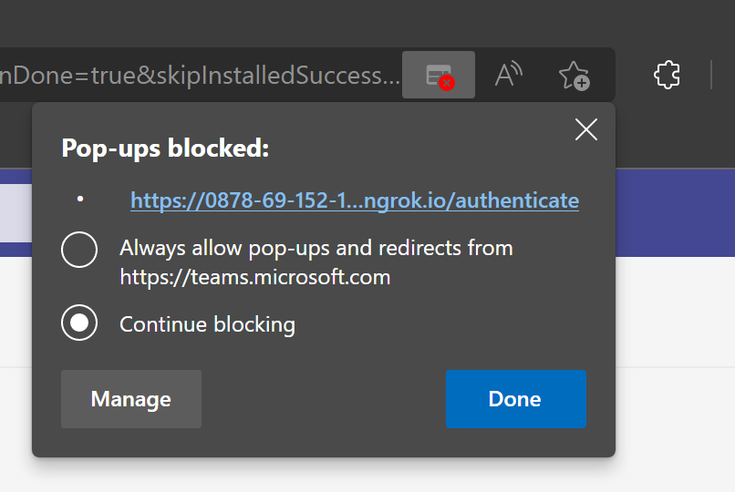

# Microsoft Graph sample Microsoft Teams app

[](https://github.com/microsoftgraph/msgraph-sample-teamsapp-dotnet/actions/workflows/dotnet.yml) 

This sample demonstrates how to use the Microsoft Graph .NET SDK to access data in Office 365 from Microsoft Teams apps.

> **NOTE:** This sample was originally built from a tutorial published on the [Microsoft Graph tutorials](https://docs.microsoft.com/graph/tutorials) page. That tutorial has been removed.

## Prerequisites

To run this sample, you need the following:

- [.NET SDK 6.x](https://dotnet.microsoft.com/download).
- [ngrok](https://ngrok.com/)
- A Microsoft work or school account in a Microsoft 365 tenant that has [enabled custom Teams app uploading](https://learn.microsoft.com/microsoftteams/platform/concepts/build-and-test/prepare-your-o365-tenant#enable-custom-teams-apps-and-turn-on-custom-app-uploading).

If you don't have a Microsoft work or school account, or your organization has not enabled custom Teams app uploading, you can [sign up for the Microsoft 365 Developer Program](https://developer.microsoft.com/microsoft-365/dev-program) to get a free Office 365 developer subscription.

This sample was written with .NET SDK 6.0.401.

## Start an ngrok tunnel

Microsoft Teams does not support local hosting for apps. The server hosting your app must be available from the cloud using HTTPS endpoints. For debugging locally, you can use ngrok to create a public URL for your locally-hosted project.

1. Open your CLI and run the following command to start ngrok.

    ```bash
    ngrok http 5223
    ```

1. Once ngrok starts, copy the HTTPS Forwarding URL.

> **IMPORTANT:** If you are using ngrok under a free plan, the forwarding URL changes every time you restart ngrok. If your forwarding URL changes, you'll need to [update the value in multiple places](#updating-ngrok-forwarding-url).

## Register a web application with the Azure Active Directory admin center

> **NOTE:** As an alternative to using the AAD admin center, you can use the [RegisterApp.ps1](RegisterApp.ps1) script. It requires the [Microsoft Graph PowerShell SDK](https://learn.microsoft.com/powershell/microsoftgraph/installation) and a work or school account with the Application administrator, Cloud application administrator, or Global administrator role.

1. Open a browser and navigate to the [Azure Active Directory admin center](https://aad.portal.azure.com). Login using a **personal account** (aka: Microsoft Account) or **Work or School Account**.

1. Select **Azure Active Directory** in the left-hand navigation, then select **App registrations** under **Manage**.

1. Select **New registration**. On the **Register an application** page, set the values as follows, where `YOUR_NGROK_URL` is the ngrok forwarding URL you copied in the previous section.

    - Set **Name** to `Graph Teams Sample`.
    - Set **Supported account types** to **Accounts in any organizational directory and personal Microsoft accounts**.
    - Under **Redirect URI**, set the first drop-down to `Web` and set the value to `YOUR_NGROK_URL/authcomplete`.

1. Select **Register**. On the **Graph Teams Sample** page, copy the value of the **Application (client) ID** and save it, you will need it in the next step.

1. Select **Certificates & secrets** under **Manage**. Select the **New client secret** button. Enter a value in **Description** and select one of the options for **Expires** and select **Add**.

1. Copy the client secret value before you leave this page. You will need it in the next step.

    > [!IMPORTANT]
    > This client secret is never shown again, so make sure you copy it now.

1. Select **API permissions** under **Manage**, then select **Add a permission**.

1. Select **Microsoft Graph**, then **Delegated permissions**.

1. Select the following permissions, then select **Add permissions**.

    - **Calendars.ReadWrite** - this will allow the app to read and write to the user's calendar.
    - **MailboxSettings.Read** - this will allow the app to get the user's time zone, date format, and time format from their mailbox settings.

### Configure Teams single sign-on

In this section you'll update the app registration to support [single sign-on in Teams](https://learn.microsoft.com/microsoftteams/platform/tabs/how-to/authentication/tab-sso-register-aad#configure-scope-for-access-token).

1. Select **Expose an API**. Select the **Set** link next to **Application ID URI**. Insert your ngrok forwarding URL domain name (with a forward slash "/" appended to the end) between the double forward slashes and the GUID. The entire ID should look similar to: `api://0878-69-152-175-12.ngrok.io/ae7d8088-3422-4c8c-a351-6ded0f21d615`.

1. In the **Scopes defined by this API** section, select **Add a scope**. Fill in the fields as follows and select **Add scope**.

    - **Scope name:** `access_as_user`
    - **Who can consent?: Admins and users**
    - **Admin consent display name:** `Access the app as the user`
    - **Admin consent description:** `Allows Teams to call the app's web APIs as the current user.`
    - **User consent display name:** `Access the app as you`
    - **User consent description:** `Allows Teams to call the app's web APIs as you.`
    - **State: Enabled**

1. In the **Authorized client applications** section, select **Add a client application**. Enter a client ID from the following list, enable the scope under **Authorized scopes**, and select **Add application**. Repeat this process for each of the client IDs in the list.

    - `1fec8e78-bce4-4aaf-ab1b-5451cc387264` (Teams mobile/desktop application)
    - `5e3ce6c0-2b1f-4285-8d4b-75ee78787346` (Teams web application)

## Configure the sample

You should have the following values from your app registration and ngrok:

- Your client ID (**Application (client) ID** value)
- Your client secret
- Your ngrok domain

1. Open your CLI in the **./GraphTeamsApp** directory and run the following commands, replacing `YOUR_CLIENT_ID` with your client ID, and `YOUR_CLIENT_SECRET` with your client secret:

    ```bash
    dotnet user-secrets init
    dotnet user-secrets set "AzureAd:ClientId" "YOUR_CLIENT_ID"
    dotnet user-secrets set "AzureAd:ClientSecret" "YOUR_CLIENT_SECRET"
    ```

1. Open [manifest.json](GraphTeamsApp/Manifest/manifest.json) in a text editor and make the following changes.

    - Replace `YOUR_NGROK_DOMAIN` with your ngrok domain (for example, `0878-69-152-175-12.ngrok.io`)
    - Replace `YOUR_CLIENT_ID` with your client ID.

## Run the sample

Open your CLI in the **./GraphTeamsApp** directory and run the following command.

```bash
dotnet run
```

## Upload the application

1. Create a ZIP file named **manifest.zip** containing the files in the [Manifest](GraphTeamsApp/Manifest/) directory.

1. Open your browser and browse to [https://teams.microsoft.com](https://teams.microsoft.com). Sign in with your Microsoft work or school account.

1. Select **Apps** on the left-hand navigation bar, then select **Manage your apps**.

1. Select **Upload an app**, then **Upload a custom app**.

1. Browse to and select **manifest.zip** and choose **Open**.

1. Verify the details and choose **Add**.

> **NOTE:** If the app gets stuck on the **Loading...** screen, make sure that your browser is not blocking pop-ups from teams.microsoft.com.
>
> 

## Updating ngrok forwarding URL

If you have restarted ngrok and your ngrok URL has changed, be sure to update the ngrok value in the following place **before** you test.

- The redirect URI in your app registration
- The application ID URI in your app registration
- `contentUrl` in manifest.json
- `validDomains` in manifest.json
- `resource` in manifest.json

Finally, you will need to recreate the manifest.zip file and re-upload it to Teams.

> **NOTE:** As an alternative to using the AAD admin center to update the app registration, you can use the [UpdateAppRegistration.ps1](UpdateAppRegistration.ps1) script. It requires the [Microsoft Graph PowerShell SDK](https://learn.microsoft.com/powershell/microsoftgraph/installation) and a work or school account with the Application administrator, Cloud application administrator, or Global administrator role.

## Code of conduct

This project has adopted the [Microsoft Open Source Code of Conduct](https://opensource.microsoft.com/codeofconduct/). For more information see the [Code of Conduct FAQ](https://opensource.microsoft.com/codeofconduct/faq/) or contact [opencode@microsoft.com](mailto:opencode@microsoft.com) with any additional questions or comments.

## Disclaimer

**THIS CODE IS PROVIDED _AS IS_ WITHOUT WARRANTY OF ANY KIND, EITHER EXPRESS OR IMPLIED, INCLUDING ANY IMPLIED WARRANTIES OF FITNESS FOR A PARTICULAR PURPOSE, MERCHANTABILITY, OR NON-INFRINGEMENT.**
