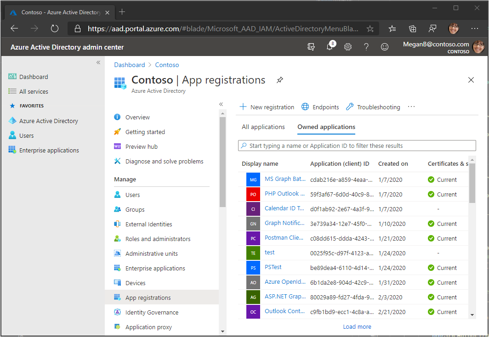
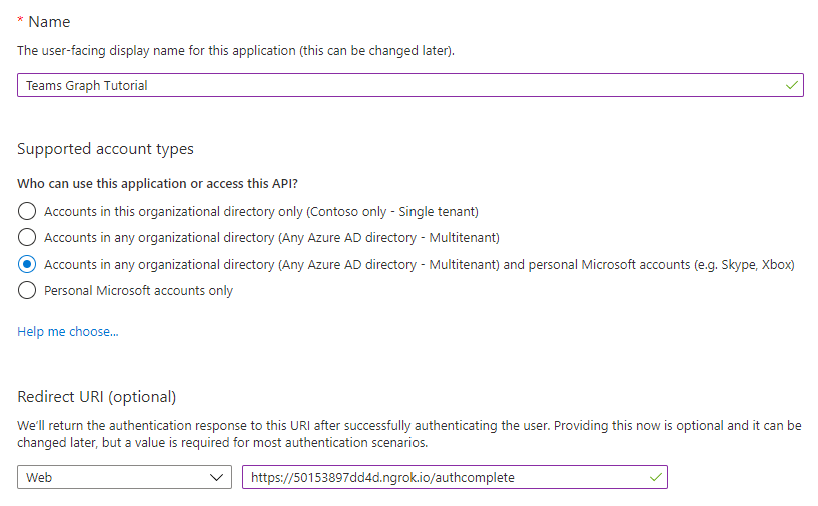
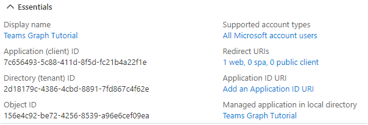
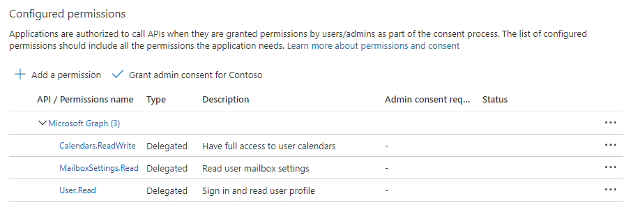
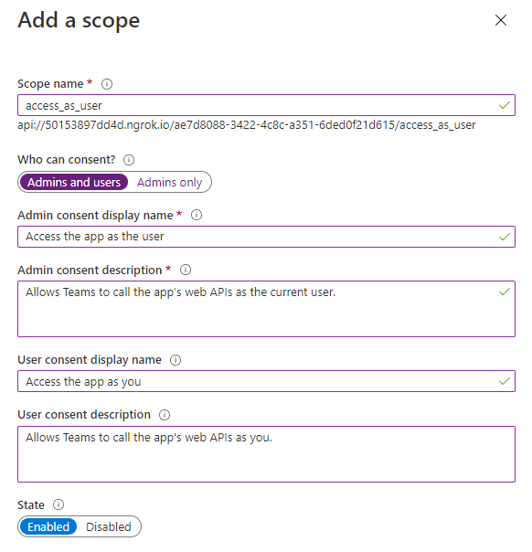

<!-- markdownlint-disable MD002 MD041 -->

In this exercise, you will create a new Azure AD web application registration using the Azure Active Directory admin center.

1. Open a browser and navigate to the [Azure Active Directory admin center](https://aad.portal.azure.com). Login using a **personal account** (aka: Microsoft Account) or **Work or School Account**.

1. Select **Azure Active Directory** in the left-hand navigation, then select **App registrations** under **Manage**.

    

1. Select **New registration**. On the **Register an application** page, set the values as follows, where `YOUR_NGROK_URL` is the ngrok forwarding URL you copied in the previous section.

    - Set **Name** to `Teams Graph Tutorial`.
    - Set **Supported account types** to **Accounts in any organizational directory and personal Microsoft accounts**.
    - Under **Redirect URI**, set the first drop-down to `Web` and set the value to `YOUR_NGROK_URL/authcomplete`.

    

1. Select **Register**. On the **Teams Graph Tutorial** page, copy the value of the **Application (client) ID** and save it, you will need it in the next step.

    

1. Select **Authentication** under **Manage**. Locate the **Implicit grant** section and enable **Access tokens** and **ID tokens**. Select **Save**.

1. Select **Certificates & secrets** under **Manage**. Select the **New client secret** button. Enter a value in **Description** and select one of the options for **Expires** and select **Add**.

1. Copy the client secret value before you leave this page. You will need it in the next step.

    > [!IMPORTANT]
    > This client secret is never shown again, so make sure you copy it now.

1. Select **API permissions** under **Manage**, then select **Add a permission**.

1. Select **Microsoft Graph**, then **Delegated permissions**.

1. Select the following permissions, then select **Add permissions**.

    - **Calendars.ReadWrite** - this will allow the app to read and write to the user's calendar.
    - **MailboxSettings.Read** - this will allow the app to get the user's time zone, date format, and time format from their mailbox settings.

    

## Configure Teams single sign-on

In this section you'll update the app registration to support [single sign-on in Teams](/microsoftteams/platform/tabs/how-to/authentication/auth-aad-sso).

1. Select **Expose an API**. Select the **Set** link next to **Application ID URI**. Insert your ngrok forwarding URL domain name (with a forward slash "/" appended to the end) between the double forward slashes and the GUID. The entire ID should look similar to: `api://50153897dd4d.ngrok.io/ae7d8088-3422-4c8c-a351-6ded0f21d615`.

1. In the **Scopes defined by this API** section, select **Add a scope**. Fill in the fields as follows and select **Add scope**.

    - **Scope name:** `access_as_user`
    - **Who can consent?: Admins and users**
    - **Admin consent display name:** `Access the app as the user`
    - **Admin consent description:** `Allows Teams to call the app's web APIs as the current user.`
    - **User consent display name:** `Access the app as you`
    - **User consent description:** `Allows Teams to call the app's web APIs as you.`
    - **State: Enabled**

    

1. In the **Authorized client applications** section, select **Add a client application**. Enter a client ID from the following list, enable the scope under **Authorized scopes**, and select **Add application**. Repeat this process for each of the client IDs in the list.

    - `1fec8e78-bce4-4aaf-ab1b-5451cc387264` (Teams mobile/desktop application)
    - `5e3ce6c0-2b1f-4285-8d4b-75ee78787346` (Teams web application)
