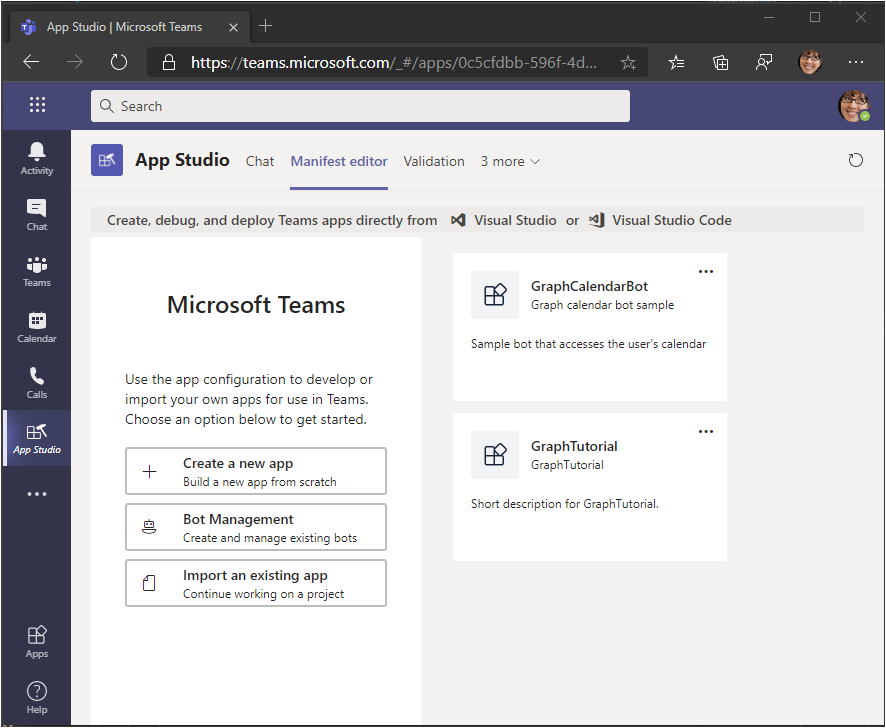
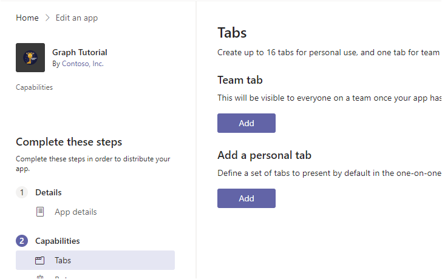

<!-- markdownlint-disable MD002 MD041 -->

The app manifest describes how the app integrates with Microsoft Teams and is required to install apps. In this section you'll use App Studio in the Microsoft Teams client to generate a manifest.

1. If you do not already have App Studio installed in Teams, [install it now](/microsoftteams/platform/concepts/build-and-test/app-studio-overview).

1. Launch App Studio in Microsoft Teams and select the **Manifest editor**.

1. Select **Create a new app**.

    

1. On the **App details** page, fill in the required fields.

    > [!NOTE]
    > You can use the default icons in the **Branding** section or upload your own.

1. On the left-hand menu, select **Tabs** under **Capabilities**.

1. Select **Add** under **Add a personal tab**.

    

1. Fill in the fields as follows, where `YOUR_NGROK_URL` is the forwarding URL you copied in the previous section. Select **Save** when done.

    - **Name:** `Graph Calendar`
    - **Entity ID:** `calendarTab`
    - **Content URL:** `YOUR_NGROK_URL`

1. On the left-hand menu, select **Domains and permissions** under **Finish**.

1. Set the **AAD App ID** to the application ID from your app registration.

1. Set the **Single-Sign-On** field to the application ID URI from your app registration.

1. On the left-hand menu, select **Test and distribute** under **Finish**. Select **Download**.

1. Create a new directory in the root of the project named **Manifest**. Extract the contents of the downloaded ZIP file to this directory.
