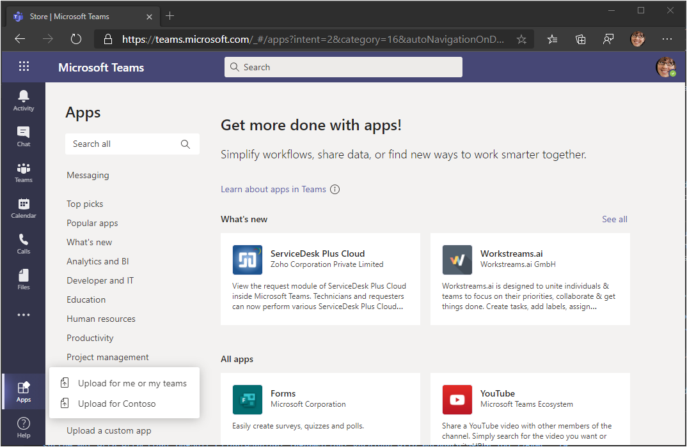

<!-- markdownlint-disable MD002 MD041 -->

In this exercise you will extend the application from the previous exercise to support single sign-on authentication with Azure AD. This is required to obtain the necessary OAuth access token to call the Microsoft Graph API. In this step you will configure the [Microsoft.Identity.Web](https://www.nuget.org/packages/Microsoft.Identity.Web/) library.

> [!IMPORTANT]
> To avoid storing the application ID and secret in source, you will use the [.NET Secret Manager](/aspnet/core/security/app-secrets) to store these values. The Secret Manager is for development purposes only, production apps should use a trusted secret manager for storing secrets.

1. Open **./appsettings.json** and replace its contents with the following.

    :::code language="json" source="../demo/GraphTutorial/appsettings.example.json" highlight="2-8":::

1. Open your CLI in the directory where **GraphTutorial.csproj** is located, and run the following commands, substituting `YOUR_APP_ID` with your application ID from the Azure portal, and `YOUR_APP_SECRET` with your application secret.

    ```Shell
    dotnet user-secrets init
    dotnet user-secrets set "AzureAd:ClientId" "YOUR_APP_ID"
    dotnet user-secrets set "AzureAd:ClientSecret" "YOUR_APP_SECRET"
    ```

## Implement sign-in

First, implement single sign-on in the app's JavaScript code. You will use the [Microsoft Teams JavaScript SDK](/javascript/api/overview/msteams-client) to get an access token which allows the JavaScript code running in the Teams client to make AJAX calls to Web API you will implement later.

1. Open **./Pages/Index.cshtml** and add the following code inside the `<script>` tag.

    ```javascript
    (function () {
      if (microsoftTeams) {
        microsoftTeams.initialize();

        microsoftTeams.authentication.getAuthToken({
          successCallback: (token) => {
            // TEMPORARY: Display the access token for debugging
            $('#tab-container').empty();

            $('<code/>', {
              text: token,
              style: 'word-break: break-all;'
            }).appendTo('#tab-container');
          },
          failureCallback: (error) => {
            renderError(error);
          }
        });
      }
    })();

    function renderError(error) {
      $('#tab-container').empty();

      $('<h1/>', {
        text: 'Error'
      }).appendTo('#tab-container');

      $('<code/>', {
        text: JSON.stringify(error, Object.getOwnPropertyNames(error)),
        style: 'word-break: break-all;'
      }).appendTo('#tab-container');
    }
    ```

    This calls the `microsoftTeams.authentication.getAuthToken` to silently authenticate as the user that is signed in to Teams. There is typically not any UI prompts involved, unless the user has to consent. The code then displays the token in the tab.

1. Save your changes and start your application by running the following command in your CLI.

    ```Shell
    dotnet run
    ```

    > [!IMPORTANT]
    > If you have restarted ngrok and your ngrok URL has changed, be sure to update the ngrok value in the following place **before** you test.
    >
    > - The redirect URI in your app registration
    > - The application ID URI in your app registration
    > - `contentUrl` in manifest.json
    > - `validDomains` in manifest.json
    > - `resource` in manifest.json

1. Create a ZIP file with **manifest.json**, **color.png**, and **outline.png**.

1. In Microsoft Teams, select **Apps** in the left-hand bar, select **Upload a custom app**, then select **Upload for me or my teams**.

    

1. Browse to the ZIP file you created previously and select **Open**.

1. Review the application information and select **Add**.

1. The application opens in Teams and displays an access token.

If you copy the token, you can paste it into [jwt.ms](https://jwt.ms). Verify that the audience (the `aud` claim) is your application ID, and the only scope (the `scp` claim) is the `access_as_user` API scope you created. That means that this token does not grant direct access to Microsoft Graph! Instead, the Web API you will implement soon will need to exchange this token using the [on-behalf-of flow](/azure/active-directory/develop/v2-oauth2-on-behalf-of-flow) to get a token that will work with Microsoft Graph calls.

## Configure authentication in the ASP.NET Core app

Start by adding the Microsoft Identity platform services to the application.

1. Open the **./Startup.cs** file and add the following `using` statement to the top of the file.

    ```csharp
    using Microsoft.Identity.Web;
    ```

1. Add the following line just before the `app.UseAuthorization();` line in the `Configure` function.

    ```csharp
    app.UseAuthentication();
    ```

1. Add the following line just after the `endpoints.MapRazorPages();` line in the `Configure` function.

    ```csharp
    endpoints.MapControllers();
    ```

1. Replace the existing `ConfigureServices` function with the following.

    :::code language="csharp" source="../demo/GraphTutorial/Startup.cs" id="ConfigureServicesSnippet":::

    This code configures the application to allow calls to Web APIs to be authenticated based on the JWT bearer token in the `Authorization` header. It also adds the token acquisition services that can exchange that token via the on-behalf-of flow.

## Create the Web API controller

1. Create a new directory in the root of the project named **Controllers**.

1. Create a new file in the **./Controllers** directory named **CalendarController.cs** and add the following code.

    ```csharp
    using System;
    using System.Collections.Generic;
    using System.Net;
    using System.Threading.Tasks;
    using Microsoft.AspNetCore.Authorization;
    using Microsoft.AspNetCore.Http;
    using Microsoft.AspNetCore.Mvc;
    using Microsoft.Extensions.Logging;
    using Microsoft.Identity.Web;
    using Microsoft.Identity.Web.Resource;
    using Microsoft.Graph;
    using TimeZoneConverter;

    namespace GraphTutorial.Controllers
    {
        [ApiController]
        [Route("[controller]")]
        [Authorize]
        public class CalendarController : ControllerBase
        {
            private static readonly string[] apiScopes = new[] { "access_as_user" };

            private readonly GraphServiceClient _graphClient;
            private readonly ITokenAcquisition _tokenAcquisition;
            private readonly ILogger<CalendarController> _logger;

            public CalendarController(ITokenAcquisition tokenAcquisition, GraphServiceClient graphClient, ILogger<CalendarController> logger)
            {
                _tokenAcquisition = tokenAcquisition;
                _graphClient = graphClient;
                _logger = logger;
            }

            [HttpGet]
            public async Task<ActionResult<string>> Get()
            {
                // This verifies that the access_as_user scope is
                // present in the bearer token, throws if not
                HttpContext.VerifyUserHasAnyAcceptedScope(apiScopes);

                // To verify that the identity libraries have authenticated
                // based on the token, log the user's name
                _logger.LogInformation($"Authenticated user: {User.GetDisplayName()}");

                try
                {
                    // TEMPORARY
                    // Get a Graph token via OBO flow
                    var token = await _tokenAcquisition
                        .GetAccessTokenForUserAsync(new[]{
                            "User.Read",
                            "MailboxSettings.Read",
                            "Calendars.ReadWrite" });

                    // Log the token
                    _logger.LogInformation($"Access token for Graph: {token}");
                    return Ok("{ \"status\": \"OK\" }");
                }
                catch (MicrosoftIdentityWebChallengeUserException ex)
                {
                    _logger.LogError(ex, "Consent required");
                    // This exception indicates consent is required.
                    // Return a 403 with "consent_required" in the body
                    // to signal to the tab it needs to prompt for consent
                    return new ContentResult {
                        StatusCode = (int)HttpStatusCode.Forbidden,
                        ContentType = "text/plain",
                        Content = "consent_required"
                    };
                }
                catch (Exception ex)
                {
                    _logger.LogError(ex, "Error occurred");
                    throw;
                }
            }
        }
    }
    ```

    This implements a Web API (`GET /calendar`) that can be called from the Teams tab. For now it simply tries to exchange the bearer token for a Graph token. The first time a user loads the tab, this will fail because they have not yet consented to allow the app access to Microsoft Graph on their behalf.

1. Open **./Pages/Index.cshtml** and replace the `successCallback` function with the following.

    ```javascript
    successCallback: (token) => {
      // TEMPORARY: Call the Web API
      fetch('/calendar', {
        headers: {
          'Authorization': `Bearer ${token}`
        }
      }).then(response => {
        response.text()
          .then(body => {
            $('#tab-container').empty();
            $('<code/>', {
              text: body
            }).appendTo('#tab-container');
          });
      }).catch(error => {
        console.error(error);
        renderError(error);
      });
    }
    ```

    This will call the Web API and display the response.

1. Save your changes and restart the app. Refresh the tab in Microsoft Teams. The page should display `consent_required`.

1. Review the log output in your CLI. Notice two things.

    - An entry like `Authenticated user: MeganB@contoso.com`. The Web API has authenticated the user based on the token sent with the API request.
    - An entry like `AADSTS65001: The user or administrator has not consented to use the application with ID...`. This is expected, since the user has not yet been prompted to consent for the requested Microsoft Graph permission scopes.

## Implement consent prompt

Because the Web API cannot prompt the user, the Teams tab will need to implement a prompt. This will only need to be done once for each user. Once a user consents, they do not need to reconsent unless they explicitly revoke access to your application.

1. Create a new file in the **./Pages** directory named **Authenticate.cshtml.cs** and add the following code.

    :::code language="csharp" source="../demo/GraphTutorial/Pages/Authenticate.cshtml.cs" id="AuthenticateModelSnippet":::

1. Create a new file in the **./Pages** directory named **Authenticate.cshtml** and add the following code.

    :::code language="razor" source="../demo/GraphTutorial/Pages/Authenticate.cshtml":::

1. Create a new file in the **./Pages** directory named **AuthComplete.cshtml** and add the following code.

    :::code language="razor" source="../demo/GraphTutorial/Pages/AuthComplete.cshtml":::

1. Open **./Pages/Index.cshtml** and add the following functions inside the `<script>` tag.

    :::code language="javascript" source="../demo/GraphTutorial/Pages/Index.cshtml" id="LoadUserCalendarSnippet":::

1. Add the following function inside the `<script>` tag to display a successful result from the Web API.

    ```javascript
    function renderCalendar(events) {
      $('#tab-container').empty();

      $('<pre/>').append($('<code/>', {
        text: JSON.stringify(events, null, 2),
        style: 'word-break: break-all;'
      })).appendTo('#tab-container');
    }
    ```

1. Replace the existing `successCallback` with the following code.

    ```javascript
    successCallback: (token) => {
      loadUserCalendar(token, (events) => {
        renderCalendar(events);
      });
    }
    ```

1. Save your changes and restart the app. Refresh the tab in Microsoft Teams. You should get a pop-up window asking for consent to the Microsoft Graph permissions scopes. After accepting, the tab should display `{ "status": "OK" }`.

    > [!NOTE]
    > If the tab displays `"FailedToOpenWindow"`, please disable pop-up blockers in your browser and reload the page.

1. Review the log output. You should see the `Access token for Graph` entry. If you parse that token, you'll notice that it contains the Microsoft Graph scopes configured in **appsettings.json**.

## Storing and refreshing tokens

At this point your application has an access token, which is sent in the `Authorization` header of API calls. This is the token that allows the app to access Microsoft Graph on the user's behalf.

However, this token is short-lived. The token expires an hour after it is issued. This is where the refresh token becomes useful. The refresh token allows the app to request a new access token without requiring the user to sign in again.

Because the app is using the Microsoft.Identity.Web library, you do not have to implement any token storage or refresh logic.

The app uses the in-memory token cache, which is sufficient for apps that do not need to persist tokens when the app restarts. Production apps may instead use the [distributed cache options](https://github.com/AzureAD/microsoft-identity-web/wiki/token-cache-serialization) in the Microsoft.Identity.Web library.

The `GetAccessTokenForUserAsync` method handles token expiration and refresh for you. It first checks the cached token, and if it is not expired, it returns it. If it is expired, it uses the cached refresh token to obtain a new one.

The **GraphServiceClient** that controllers get via dependency injection is pre-configured with an authentication provider that uses `GetAccessTokenForUserAsync` for you.
