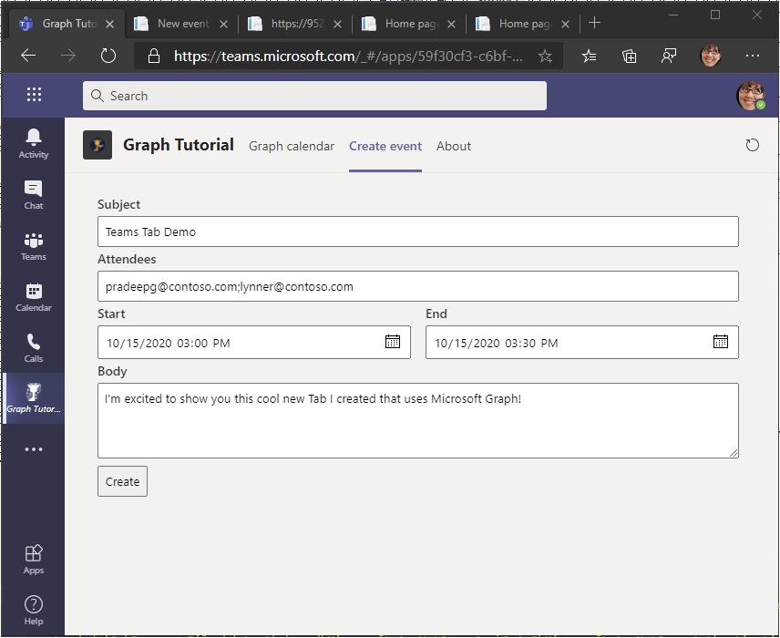

<!-- markdownlint-disable MD002 MD041 -->

In this section you will add the ability to create events on the user's calendar.

## Create the new event tab

1. Create a new file in the **./Pages** directory named **NewEvent.cshtml** and add the following code.

    :::code language="razor" source="../demo/GraphTutorial/Pages/NewEvent.cshtml":::

    This implements a simple form, and adds JavaScript to post the form data to the Web API.

## Implement the Web API

1. Create a new directory named **Models** in the root of the project.

1. Create a new file in the **./Models** directory named **NewEvent.cs** and add the following code.

    :::code language="csharp" source="../demo/GraphTutorial/Models/NewEvent.cs" id="NewEventSnippet":::

1. Open **./Controllers/CalendarController.cs** and add the following `using` statement at the top of the file.

    ```csharp
    using GraphTutorial.Models;
    ```

1. Add the following function to the **CalendarController** class.

    :::code language="csharp" source="../demo/GraphTutorial/Controllers/CalendarController.cs" id="PostSnippet":::

    This allows an HTTP POST to the Web API with the fields of the form.

1. Save all of your changes and restart the application. Refresh the app in Microsoft Teams, and select the **Create event** tab. Fill out the form and select **Create** to add an event to the user's calendar.

    
